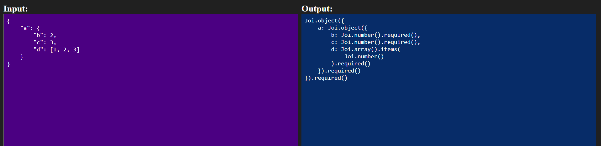

# Joi schema generator

Tool for generating schemas based on JS/JSON objects/arrays.  
Available as a web application on http://mterczynski.pl/joi-schema-generator and as a CLI tool.



## CLI Usage

### Installation

To use the CLI tool globally:

```bash
npm install -g joi-schema-generation
```

Or use it locally in your project:

```bash
npm install joi-schema-generation
```

### Running the CLI

**From stdin:**

```bash
echo '{"name": "John", "age": 30}' | joi-schema-generator
```

**From a file:**

```bash
joi-schema-generator --input data.json
```

**With options:**

```bash
# Generate schema without required fields
joi-schema-generator --input data.json --no-required

# Generate schema with trailing commas
joi-schema-generator --input data.json --trailing-commas
```

**Available options:**
- `-i, --input <file>` - Input file containing JSON/JS object
- `-r, --required` - Make all fields required (default: true)
- `--no-required` - Do not make fields required
- `-t, --trailing-commas` - Use trailing commas in generated schema
- `-V, --version` - Output version number
- `-h, --help` - Display help

## Example

```json
{
    "squadName": "Super hero squad",
    "homeTown": "Metro City",
    "formed": 20,
    "secretBase": "Super tower",
    "active": true,
    "members": [
        {
            "name": "Molecule Man",
            "age": 29,
            "secretIdentity": "Dan Jukes",
            "powers": [
                "Radiation resistance",
                "Turning tiny",
                "Radiation blast"
            ]
        }
    ]
}
```

## Example

Input:

```javascript
Joi.object({
    squadName: Joi.string().required(),
    homeTown: Joi.string().required(),
    formed: Joi.number().required(),
    secretBase: Joi.string().required(),
    active: Joi.boolean().required(),
    members: Joi.array()
        .items(
            Joi.object({
                name: Joi.string().required(),
                age: Joi.number().required(),
                secretIdentity: Joi.string().required(),
                powers: Joi.array().items(Joi.string()).required(),
            })
        )
        .required(),
}).required();
```

Output:

```javascript
Joi.object({
    squadName: Joi.string().required(),
    homeTown: Joi.string().required(),
    formed: Joi.number().required(),
    secretBase: Joi.string().required(),
    active: Joi.boolean().required(),
    members: Joi.array()
        .items(
            Joi.object({
                name: Joi.string().required(),
                age: Joi.number().required(),
                secretIdentity: Joi.string().required(),
                powers: Joi.array().items(Joi.string()).required(),
            })
        )
        .required(),
}).required();
```

## Color palette

https://coolors.co/b090e0-f08d49-2d2d2d-3a7f52

## Scripts

### npm install

Installs dependencies required to run the application and tests

### npm test

Runs the tests

### npm start

Runs the application in development mode (it uses watch mode with hot reloading)

### npm run build

Compiles the application into a deployable build folder

### npm run build:cli

Compiles the CLI tool into the dist folder
