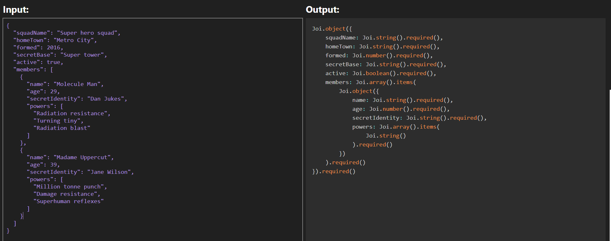

# Joi schema generator

Tool for generating schemas based on JS/JSON objects/arrays.  
Application is available on http://mterczynski.pl/joi-schema-generator



Example input:

```json
{
  "squadName": "Super hero squad",
  "homeTown": "Metro City",
  "formed": 20,
  "secretBase": "Super tower",
  "active": true,
  "members": [
    {
      "name": "Molecule Man",
      "age": 29,
      "secretIdentity": "Dan Jukes",
      "powers": [
        "Radiation resistance",
        "Turning tiny",
        "Radiation blast"
      ]
    }
  ]
}
```

Example output:

```javascript
Joi.object({
    squadName: Joi.string().required(),
    homeTown: Joi.string().required(),
    formed: Joi.number().required(),
    secretBase: Joi.string().required(),
    active: Joi.boolean().required(),
    members: Joi.array().items(
        Joi.object({
            name: Joi.string().required(),
            age: Joi.number().required(),
            secretIdentity: Joi.string().required(),
            powers: Joi.array().items(
                Joi.string()
            ).required()
        })
    ).required()
}).required()
```

## Scripts

### npm install

Installs dependencies required to run the app and tests

### npm test

Runs the tests

### npm start

Runs the app in development mode (watch mode with hot reloading)

### npm run build

Compiles the app into a deployable /build folder
